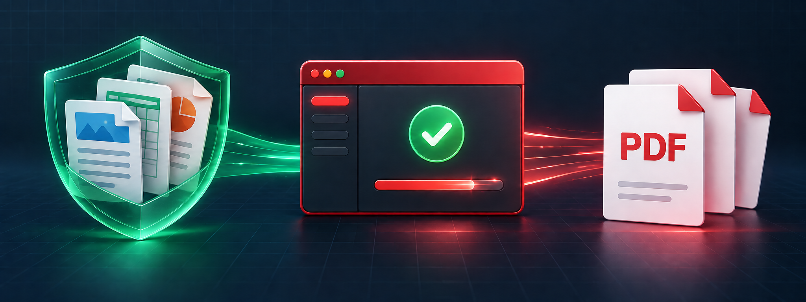
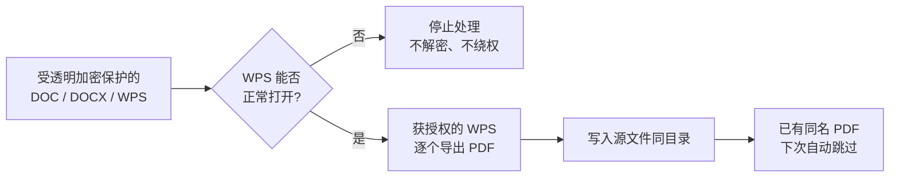

<div align="center">



# WPS Batch PDF Converter

### 绿盾等透明加密环境下，用 WPS 快速批量转 PDF

**普通脚本读不到，WPS 可以打开；Adobe 转换太慢，WPS 原生批量又可能需要会员。**<br>
把 WPS 免费的单文件导出能力，自动串成一条本地批处理流水线。

[](https://github.com/jedliuai/wps-batch-pdf-converter/releases/latest) [](WPS转PDF神器.py)

[](https://github.com/jedliuai/wps-batch-pdf-converter/releases/latest) [](https://github.com/jedliuai/wps-batch-pdf-converter/releases) [](#运行条件与边界) [](LICENSE)

[适用场景](#-先判断它是否适合你) · [30 秒上手](#-30-秒开始使用) · [能力说明](#-真实能力与默认行为) · [安全边界](#-运行条件与边界) · [问题反馈](https://github.com/jedliuai/wps-batch-pdf-converter/issues)

</div>

> [!IMPORTANT]
> **使用前提：你必须能够在这台电脑上用 WPS 正常打开并导出目标文档。**<br>
> 如果 WPS 自己也打不开，或当前账号没有读取、导出权限，本工具同样无法处理。它不负责解密，也不会绕过企业安全策略。

## ✨ 为什么会有这个项目

这不是一个面向所有人的通用 Word 转 PDF 工具，而是为一种很具体的办公困境而生：

| 现实限制 | 这个项目的应对方式 |
| :--- | :--- |
| 🔒 绿盾等透明加密让普通 Python/headless 程序无法读取文档 | 让**当前环境已授权的 WPS** 正常打开并导出 |
| 🐢 Adobe 等获授权软件可以处理，但实际转换速度太慢 | 使用 WPS **更快、版式稳定**的单文件导出能力 |
| 💎 WPS 单文件导出免费，原生批量 PDF 导出属于会员功能 | 不调用会员入口，把正常的**单文件导出自动串成批处理** |
| 📁 文件散落在多层目录，手工逐个操作费时 | 自动递归扫描、转换并跳过已有 PDF |

> [!NOTE]
> WPS 的功能与会员权益可能随版本和地区变化，请以当前官方说明为准。<br>
> [WPS 官方教程：普通导出与会员批量导出说明](https://www.wps.com/academy/how-to-convert-word-excel-ppt-to-pdf-for-free-in-wps-office-quick-tutorials-1863083/)

## 🎯 先判断它是否适合你

| 你的情况 | 判断 |
| :--- | :---: |
| 文档受绿盾等软件保护，普通脚本读不到，但 WPS 可以正常打开和导出 | ✅ **正是核心场景** |
| Adobe 等获授权软件也能处理，但在实际环境中转换太慢 | ✅ **适合** |
| 文档没有加密，也没有软件访问限制 | ⚠️ 通常没必要 |
| WPS 无法打开，或当前用户没有读取、导出权限 | ❌ **无法处理** |
| 需要在 macOS、Linux、服务器或无人值守环境运行 | ❌ **不适合** |

普通未加密文档，建议优先考虑更通用的 Python、LibreOffice 或 headless 批量方案；本项目的独特价值在于 **普通进程读不到，但获授权的 WPS 读得到**。

## 🚀 30 秒开始使用

1. 确认已安装桌面版 **WPS Office**，并用 WPS 手动打开一个目标文档验证权限。
2. 从 [Releases](https://github.com/jedliuai/wps-batch-pdf-converter/releases/latest) 下载 `WPS-Batch-PDF-Converter-*-Windows-x64.exe`。
3. 双击运行，选择存放文档的根文件夹，等待转换完成。

```text
📂 选择根文件夹
│
├─ 客户 A/报价单.docx  ──→  客户 A/报价单.pdf
├─ 客户 A/说明书.wps   ──→  客户 A/说明书.pdf
├─ 客户 B/合同.doc      ──→  客户 B/合同.pdf
└─ 客户 B/已归档.docx   ──→  已有同名 PDF，自动跳过
```

> [!TIP]
> 转换过程中 WPS 窗口保持可见是正常行为。这能兼容部分文档保护环境的访问策略，请不要手动关闭 WPS。

> [!WARNING]
> Release EXE 暂未进行商业代码签名，Windows 首次运行时可能显示 SmartScreen 提示。请只从本仓库 Release 下载；SHA-256 校验值会写在对应 Release 说明中。

## ⚡ 核心能力

| | | |
| :--- | :--- | :--- |
| 🔐 **受限环境适配**<br>借助获授权的桌面版 WPS 访问文档 | ⚡ **快速批量导出**<br>复用 WPS 单文件转 PDF 能力 | 🌲 **递归扫描**<br>自动处理所有下级文件夹 |
| 🛡️ **完全本地**<br>源码没有文档上传逻辑 | ♻️ **断点友好**<br>已有同名 PDF 自动跳过 | 📊 **进度可见**<br>显示成功、失败与当前文件 |

## 📋 真实能力与默认行为

| 项目 | 当前行为 |
| :--- | :--- |
| **输入格式** | `.doc`、`.docx`、`.wps` |
| **扫描范围** | 所选文件夹及全部子文件夹 |
| **输出位置** | 与源文档相同目录、相同文件名 |
| **已有 PDF** | 自动跳过，不覆盖 |
| **临时文件** | 自动忽略以 `~$` 开头的文件 |
| **转换引擎** | 本机 WPS Office，通过 Windows COM 调用 |
| **文件传输** | 完全本地处理，不上传到云端 |
| **过程反馈** | 控制台显示总数、当前进度、成功数与失败数 |

## 🧭 它是如何工作的



## 🛡️ 运行条件与边界

- 仅支持 **Windows**，需要已安装并可正常使用的桌面版 WPS Office。
- 只有 WPS 本身能正常打开、并获准导出的文档才可能转换成功。
- 程序让 WPS 保持可见并走正常的打开、导出流程，**不会自行解密、修改绿盾、绕过权限或规避企业安全策略**。
- 最终版式以 WPS 打开文档时的效果为准；速度取决于 WPS、文档复杂度与电脑性能。
- 同目录已有同名 PDF 时会直接跳过。如需重新生成，请先自行备份或移走旧 PDF。

### 这是在绕过 WPS 会员吗？

**不是。** 本工具不会解锁或调用 WPS 的会员批量转换入口，也不会修改 WPS、账号或授权状态。它只是对每个有权正常打开的文档，依次调用 WPS 桌面版自身的单文件 PDF 导出能力。请遵守 WPS 的许可条款和所在组织的安全政策。

<details>
<summary><strong>🧑‍💻 从源码运行</strong></summary>

需要 Python 3.9+（推荐 64 位 Windows）：

```powershell
git clone https://github.com/jedliuai/wps-batch-pdf-converter.git
cd wps-batch-pdf-converter
python -m pip install -r requirements.txt
python ".\WPS转PDF神器.py"
```

自行构建单文件 EXE：

```powershell
python -m pip install pyinstaller
pyinstaller --clean ".\WPS转PDF神器.spec"
```

</details>

<details>
<summary><strong>🔍 隐私、安全与问题反馈</strong></summary>

程序只遍历你主动选择的本地文件夹，并通过本机 WPS 打开和导出文档；源码中没有网络上传逻辑。对安全敏感的环境，建议审阅源码后运行或自行构建。

报告问题时，请提供 Windows 版本、WPS 版本、输入扩展名、是否处于文档保护环境，以及脱敏后的控制台错误信息。**请勿上传含敏感内容的原始文档。**

[提交问题](https://github.com/jedliuai/wps-batch-pdf-converter/issues/new/choose)

</details>

---

<div align="center">

### 如果它替你省下了重复劳动

[](https://github.com/jedliuai/wps-batch-pdf-converter)

欢迎 Star、分享给处在相同办公环境中的人，或通过 Issue 帮助它覆盖更多真实场景。

MIT License · Maintained by [Jed (@jedliuai)](https://github.com/jedliuai)<br>
[查看更多面向真实工作流的开源自动化工具](https://github.com/jedliuai?tab=repositories)

</div>
